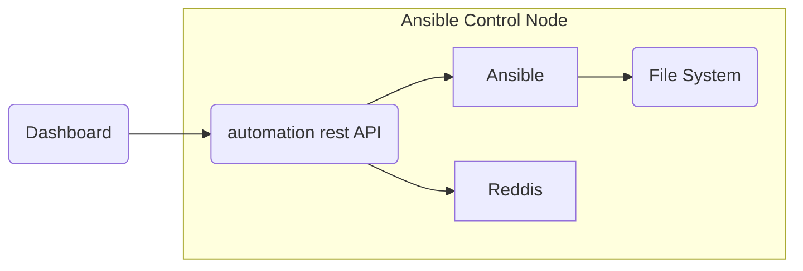

Diagrams in webpages using <https://mermaidjs.github.io/>.

Results in this.

graph LR;
  dash(Dashboard) --> api(automation rest API);
  subgraph Ansible Control Node
    api --> Ansible
    api --> Reddis
    Ansible --> fs(File System)
  end

